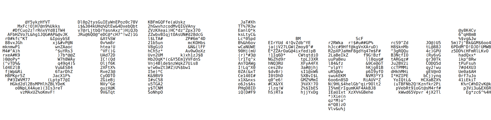

## One-time-password Component

An OTP input written in React + TS.

Devoid of `useState` calls.
All you get from a regular input:

- Paste works excellently, inputting only numbers from the clipboard.
- Focus works as expected, and updates per the in-line edit.

Autofill from SMS using the WebOTP API to boot.
